# Overview

Analytics는 자사의 게임앱을 이용하는 유저들의 이용패턴과 다양한 지표에 대한 분석 데이터뿐만 아니라, 목적에 따른 대상선정에서 분석까지 원스탑으로 진행할 수 있는 인앱캠페인 관리서비스를 지원합니다. 
Analytics가 제공하는 분석데이터와 캠페인관리 서비스를 이용하시려면 컴퍼니 및 앱을 등록 후, Analytics에서 제공하는 SDK 적용이 필요합니다. (SDK는 iOS, 안드로이드, Unity를 지원합니다.)

# 서비스구조

Analytics SDK는 앱 이용자 로그를 수집하고, Analytics 웹에서 설정하는 캠페인을 앱에 노출될 수 있도록 합니다. Analytics 분석/프로모션 시스템은 SDK로부터 로그를 수집/분석하고, 게임서버 등과 통신하여 캠페인이 진행되도록 합니다.

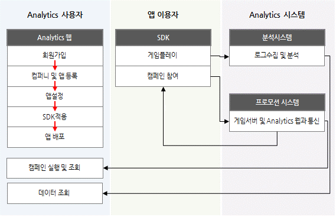

[그림 1 서비스구조도]

Analytics는 TOAST Cloud 웹 콘솔에서 시작하시거나, 바로 Analytics 사이트에서 시작하실 수 있습니다. Analytics 만을 사용하는 이용자는 Analytics 사이트 (<http://analytics.toast.com>) 에서, TOAST Cloud 상품을 이용하는 이용자는 TOAST Cloud 웹콘솔(<http://console.cloud.toast.com>)에서 바로 시작하실 수 있습니다.  
이 문서는 Analytics 사이트로 직접 접속하는 경우 위주로 설명합니다. TOAST Cloud 웹콘솔에서 시작하는 경우는 TOAST Cloud Console에서 시작하기를 참조해주세요.

# Analytics 사이트에서 시작하기

## 로그인 및 이용안내

 Analytics 서비스를 이용하시려면 서비스에 로그인 후 앱을 등록해야 합니다. 만일 아직 회원이 아니시라면 회원등록 후 로그인 하여 진행하실 수 있습니다. 
처음 Analytics에 로그인하시면 앱등록을 하거나, 기존에 있던 앱에 조인신청을 하거나 Analytics에서 제공하는 기능들을 살펴보실 수 있습니다. 이미 컴퍼니나 앱에 소속되어 있는 경우라면 아래의 안내 화면은 노출되지 않습니다.

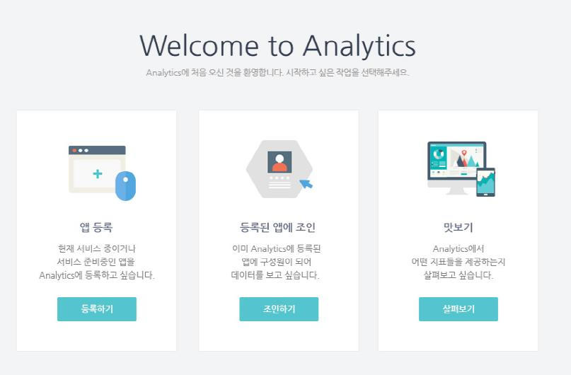

[그림 2 Anlaytics 이용안내]

1. 앱 등록
Analytics의 서비스를 사용하려면 앱을 등록해야 합니다. 앱은 서비스 중이거나 서비스 준비중인 경우에도 등록하실 수 있습니다. 앱을 등록하기 위해서는 컴퍼니에 등록되어 있어야 합니다. 컴퍼니 등록을 위한 자세한 과정은 ‘1.2 컴퍼니 검색 또는 생성’ 항목을 참조하세요.

2. 등록된 앱에 조인
Analytics에 등록되어 있는 앱의 구성원이 되어 분석 데이터를 보시고 싶다면 조인신청을 해주세요. 해당 앱 담당자의 검토를 거쳐 앱 구성원이 되실 수 있습니다. 
[조인하기] 버튼을 누르시면 앱 구성원 조인신청 팝업에서 조인을 신청하는 앱 이름과 본인의 계정을 확인하신 후 신청문구를 작성하여 확인 버튼을 눌러주세요. 앱 구성원이 되시려면 해당 앱 담당자로부터 초대를 받으셔야 하므로 신청자가 누구인지를 확인할 수 있는 정보를 입력해주시기 바랍니다. 담당자가 앱 조인 신청을 확인하여 앱 구성원으로 추가하면 추가되었음을 알리는 메일이 신청자에게 발송됩니다. 앱 구성원으로 추가된 후 Analytics에 로그인 하시면 해당 앱의 분석 데이터를 보실 수 있습니다.

3. 맛보기
맛보기에서는 데모계정으로 로그인하여 Analytics에서 제공하는 분석 지표 및 기능들을 살펴보실 수 있습니다.

## 컴퍼니 검색 또는 생성

1. 컴퍼니 검색 및 구성원 추가 신청하기
Analytics는 개별 앱의 데이터를 분석하여 볼 수 있을 뿐 아니라, 회사 단위로 앱들의 데이터를 한번에 볼 수 있도록 지원합니다. 이를 위해, 앱을 등록하기 위해서는 반드시 컴퍼니에 소속되어 있어야 하므로 아직 컴퍼니에 소속되어 있지 않은 이용자가 앱을 등록하려는 경우 다음과 같은 컴퍼니 검색 화면을 보실 수 있습니다.
혹시 만들려는 컴퍼니가 이미 Analytics에 생성되어 있지 않은지 먼저 컴퍼니명을 검색하여 확인해보세요.

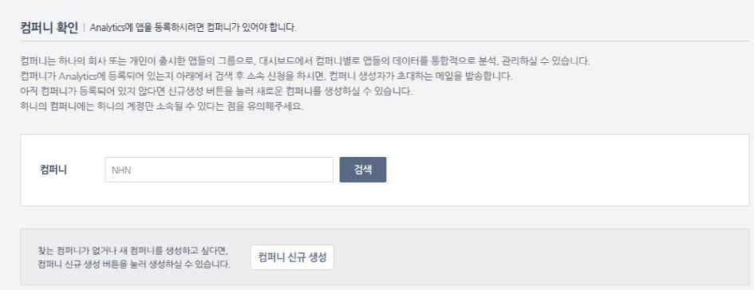

[그림 4 컴퍼니 검색화면]

검색한 컴퍼니명으로 등록된 컴퍼니가 있다면 다음과 같이 검색리스트가 노출됩니다. 이 중 구성원이 되고 싶은 컴퍼니를 선택 후 [신청하기] 버튼을 눌러주세요.

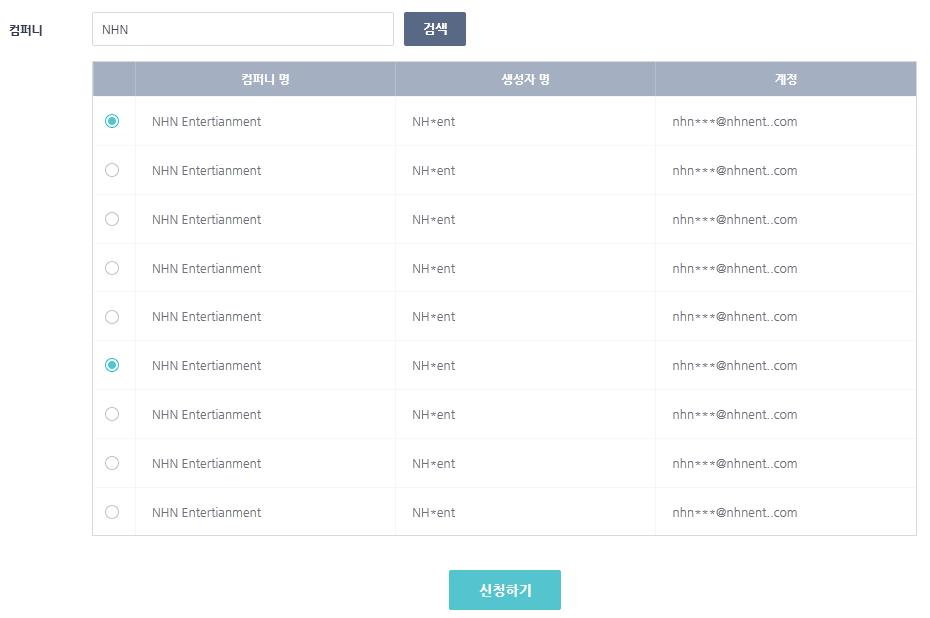
컴퍼니 조인신청 팝업에서 조인을 신청하는 컴퍼니명과 본인의 계정을 확인하신 후 신청문구를 작성하여 확인 버튼을 눌러주세요. 컴퍼니 구성원이 되시려면 컴퍼니 생성자로부터 초대를 받으셔야 하므로 신청자가 누구인지를 확인할 수 있는 정보를 입력해주시기 바랍니다. 컴퍼니 생성자가 컴퍼니 조인 신청을 확인하면 신청자의 이메일로 컴퍼니 초대요청을 보내게 되며, 초대요청 메일을 통해 컴퍼니에 소속되며, 그 이후 앱 등록이 가능합니다. 컴퍼니에 소속된 계정이 등록한 앱은 자동으로 해당 컴퍼니 소속의 앱이 된다는 점은 꼭 기억해주세요.

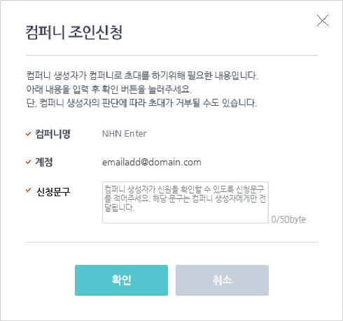
2. 컴퍼니 생성하기
만일 구성원이 되고 싶은 컴퍼니가 없는 경우, 신규로 컴퍼니를 생성하실 수 있습니다. 컴퍼니 생성화면에서 [컴퍼니 신규생성하기] 버튼을 누르면 아래와 같은 컴퍼니 생성화면을 보실 수 있습니다. 
컴퍼니에 소속된 계정이 등록한 앱은 자동으로 해당 컴퍼니 소속의 앱이 되므로 정확한 데이터 분석을 위해 컴퍼니는 각 회사 단위로 1개만 만드는 것을 권장합니다. 한 번 등록하신 컴퍼니 이름은 수정이 불가능하오니 주의해주세요. 이제 사용하고 싶은 컴퍼니 명을 입력하시고 [생성] 버튼을 눌러주세요.

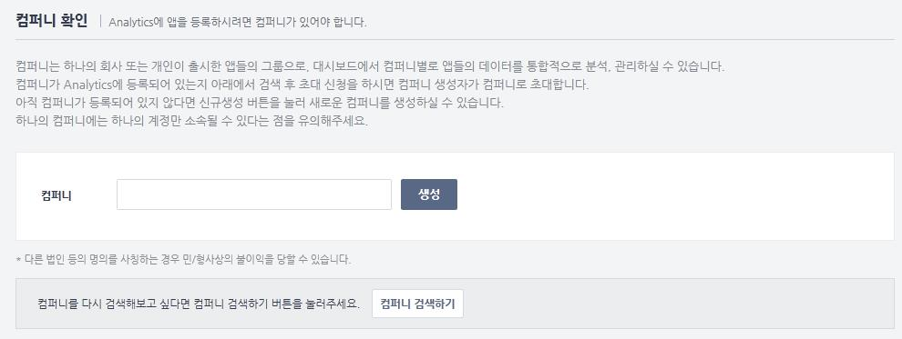

## 앱 등록하기

1. 앱 기본정보 등록
Analytics에 앱을 등록하려면 앱 기본정보 입력 페이지에서 다음 내용을 입력하신 후 저장버튼을 눌러주세요.
1)컴퍼니
앱을 등록하는 계정이 소속된 컴퍼니 명이 노출됩니다.
2)앱 이름
등록하실 앱의 이름을 입력해주세요. 입력하신 이름으로 Analytics 사이트에서 노출됩니다, 등록하신 앱 이름은 수정이 불가능합니다.
3)앱 썸네일
등록하실 앱의 섬네일을 업로드 해주세요. 해당 이미지로 Analytics 사이트에서 노출됩니다.
4)화면방향
등록하실 앱이 지원하는 화면 방향을 선택해주세요. 화면방향은 향후 캠페인 사용 시 해당 정보가 사용됩니다.
5)OS
등록하실 앱이 지원하는 OS를 모두 선택해주세요. OS별로 별도의 앱으로 등록하시면 로그분석 데이터도 별개로 수집 되므로 지원하는 OS를 모두 선택하시는 것을 권장합니다.
6)서비스 플랫폼
해당 앱이 탑재하는 서비스 플랫폼 (카카오톡, 라인 등)이 있다면 선택해주세요. 한 번 선택하신 서비스 플랫폼은 수정이 불가능합니다.
7)앱 오픈일
입력하신 앱 오픈일부터 해당 앱의 로그 데이터가 전사 대시보드에 합산됩니다. 이에 따라 앱 오픈일은 수정이 불가능하므로 신중하게 입력해주세요. 단, 전사 대시보드에 합산되는 데이터가 아닌 앱의 개별 데이터정보는 앱 오픈일 이전부터도 각 메뉴에서 확인하실 수 있습니다.
8)패키지명(or 번들아이디)
안드로이드의 경우 패키지명, iOS의 경우 번들아이디를 등록해주세요. 해당 정보는 마케팅에서 유입채널을 추적하는 트래킹 URL을 제공하기 위해 사용됩니다.

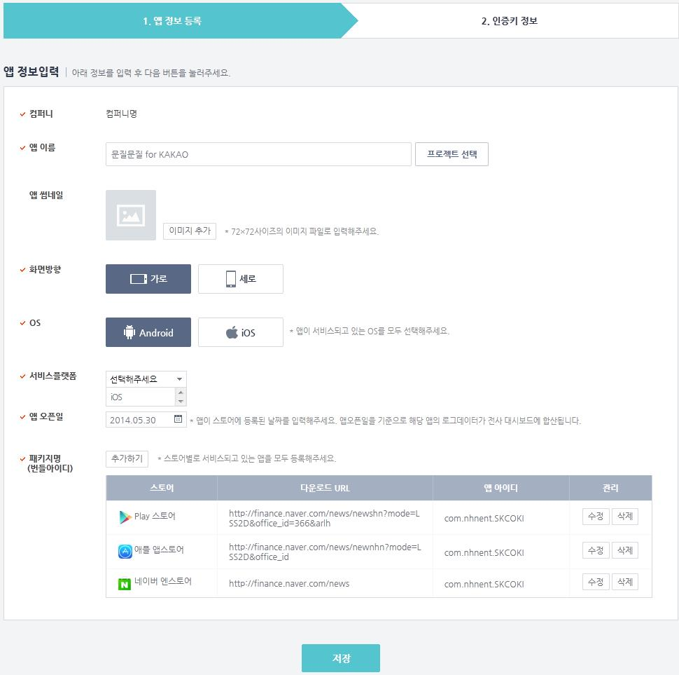

[참고]
만일 TOAST Cloud 웹 콘솔에서 진입한 경우, 컴퍼니에 소속되지 않은 계정은 앱 기본정보 입력 시 컴퍼니명을 입력하여 컴퍼니를 생성할 수 있습니다.
또한 기존에 생성했던 프로젝트가 있는 경우에는 [프로젝트 선택] 버튼을 클릭해 어떤 프로젝트를 Analytics에서 사용하실 것인지 선택하실 수 있습니다. 해당 버튼은 TOAST Cloud 웹 콘솔에서 생성한 프로젝트가 있는 경우에 한해 노출됩니다. (프로젝트와 앱은 동일한 단위로, TAOST Cloud에서는 프로젝트로, Analytics에서는 앱으로 지칭합니다.)

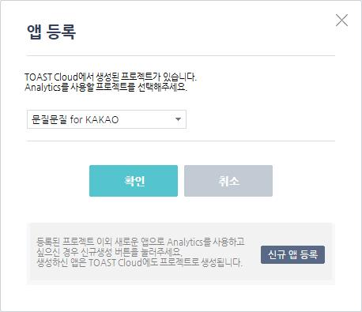

2. SDK 적용을 위한 정보 확인
앱 정보를 모두 입력한 후 [저장] 버튼을 누르면 SDK 연동에 필요한 인증키가 생성됩니다. 발급된 앱 아이디와 컴퍼니번호는 SDK 연동 시 사용되는 정보입니다. 플랫폼 별 SDK 및 적용 가이드는 페이지 하단의 개발가이드를 참조하시기 바랍니다.

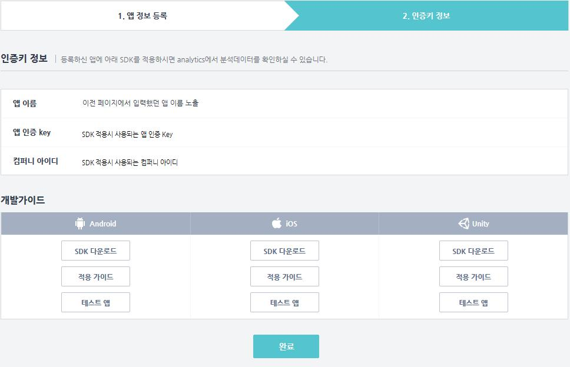

3. 앱등록 완료
인증키 정보 페이지에서 [완료] 버튼을 누르면 앱의 페이지가 생성됩니다. 앱 페이지만 생성된 상태이므로 분석 데이터는 노출되지 않으며, 앱에 Analytics SDK 연동해야 실제 데이터의 수집과 분석이 이루어집니다. SDK 연동 후 앱을 배포하면 Analytics의 서비스를 사용할 수 있는 기본준비가 완료됩니다.
[참고]
Analytics 사이트 내에서 앱 등록버튼은 LNB의 앱 리스트 하단에 위치하고 있습니다. 앱등록 버튼을 누르시면 앱 기본정보 입력 페이지로 이동합니다.

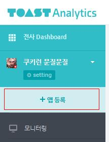

## 앱 설정하기

앱 설정은 앱 기본정보, 구성원설정, 분석설정, 마케팅관리, 캠페인설정, 푸쉬설정으로 구성되어 있으며, 앱의 전체적인 관리를 하실 수 있습니다. 
앱 설정 메뉴는 GNB의 앱 이름 옆에 노출되는 톱니바퀴 모양의 버튼을 눌러 들어가실 수 있습니다.

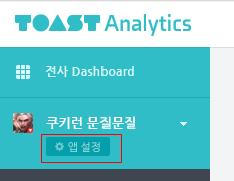

1. 앱 기본정보

앱 기본정보 조회 및 수정
앱 등록 시 입력한 기본정보가 노출되며, [수정] 버튼을 누르시면 앱 정보를 수정하실 수 있습니다. 만일 화면 방향 또는 OS를 변경하시는 경우, 캠페인 진행 시 영향을 미칠 수 있으니 주의 깊게 설정해 주세요.
앱 삭제
해당 앱의 어드민인 경우에는 [앱 삭제하기] 버튼을 눌러 앱을 삭제하실 수 있습니다. 앱은 삭제된 즉시 Analytics에서 더 이상 사용되지 않습니다. 만일 앱을 잘못 삭제하셨다면 삭제일로부터 30일 이내에 고객센터를 통해 앱 삭제 취소를 해주세요. 다만 이 경우, 삭제한 날로부터 삭제 취소시까지의 데이터는 수집되지 않습니다.
2. 구성원 설정
앱 구성원 정보는 해당 앱 관리자 이상만 조회 및 편집이 가능합니다. 앱 구성원 권한레벨은 다음과 같이 구분합니다.
어드민: 해당 앱의 분석데이터를 조회할 수 있고, 캠페인 등록 등의 운영과 앱 설정 및 정보를 변경할 수 있는 계정
멤버: 해당 앱 데이터 및 앱 기본 정보에 대한 조회만 가능한 계정 (운영, 설정 사용 불가)

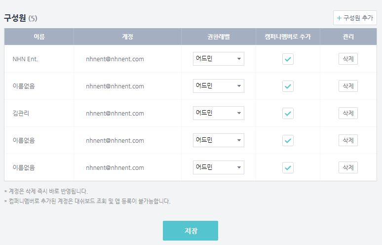

앱 구성원을 컴퍼니 멤버로 추가하기
앱 구성원을 컴퍼니 멤버로 추가하는 것은 해당 앱을 analytics에 등록한 앱 생성자만 가능합니다. 컴퍼니 멤버로 추가된 계정은 해당 컴퍼니의 대시보드를 조회할 수 있게 됩니다.
앱 구성원 삭제하기
앱 구성원 중, 더 이상 앱의 분석데이터를 공유하지 않을 계정 삭제하실 수 있습니다. 앱 구성원 삭제는 어드민 권한을 가진 계정은 누구나 가능하며, 삭제 결과는 실시간으로 반영됩니다. 만일 실수로 계정을 삭제하셨다면 구성원 추가 버튼을 눌러 다시 추가하실 수 있습니다.
앱 구성원 추가하기
해당 앱의 데이터를 조회해야 하는 사람이 있다면 앱 구성원으로 추가하실 수 있습니다. [구성원 추가] 버튼을 누르시면 컴퍼니 구성원을 앱에 추가하거나 이메일 주소로 신규초대를 할 수 있습니다. 단, 신규초대의 경우 TOAST Cloud의 회원이어야 하며, 별다른 승인절차 없이 바로 앱 구성원으로 추가됩니다.
3. 분석설정
분석설정은 유저의 앱 데이터를 분석하기 위해 필요한 설정입니다. 분석설정에서 설정된 항목 및 그룹을 기준으로 분석 페이지에 노출됩니다.

커스텀 이벤트 설정
상세분석 항목 중 유저의 상태나 플레이 등을 자세히 분석할 수 있는 커스텀 이벤트 분석을 위해 수집된 이벤트 로그를 관리하는 메뉴입니다. 수집로그는 일단위로 자동으로 수집 및 업데이트 됩니다. 커스텀 이벤트의 각 항목은 필요에 따라 분석 시 사용여부를 관리할 수 있습니다. 노출명은 디폴트로 수집된 로그와 동일하게 노출되며 편의에 따라 수정 가능합니다.
그룹설정
이용자 그룹이나 캠페인대상 그룹을 생성하기 위해 필요한 설정입니다. 레벨, 누적구매금액, 방문일수, 미방문일수, 보유친구수 항목에 대한 그룹구간을 설정하실 수 있습니다. 설정된 그룹구간은 변경가능하나, 이미 분석이 완료된 과거일자 데이터의 경우에는 변경된 그룹으로 다시 분석을 진행하지 않습니다.
4. 마케팅관리
유입경로별 비교를 위해 트래킹할 마케팅 채널 및 유입경로를 설정할 수 있습니다. 일부 채널은 디폴트로 제공되며, 등록하신 유입경로 별로 세분화된 마케팅 효과를 확인하실 수 있습니다.

5. 캠페인
Analytics에서 캠페인이란 앱 내에서 팝업이나 배너를 통해 사용자에게 광고나 이벤트를 보여주고 사용자의 참여를 유도할 수 있는 인하우스 캠페인 기능을 의미합니다. 
캠페인 설정 및 실행은 별도 카테고리로 제공되는 캠페인 가이드를 참고하시기 바랍니다.

6. 푸쉬설정
캠페인을 진행하실 때 푸쉬 발송 기능을 함께 사용하실 수 있습니다. 다만, 푸쉬는 캠페인 진행 시에만 사용가능하며 Analytics의 푸쉬 발송 기능만을 단독으로 사용하실 수는 없습니다. 
푸쉬발송 기능을 사용하시려면 APNS 인증서 (iOS) 또는 GCM API Key (안드로이드)를 발급받아 푸시설정 페이지에 등록해주셔야 합니다. 자세한 내용은 별도 카테고리로 제공되는 캠페인 가이드를 참고하시기 바랍니다.

7. PROMOTION 설정
PROMOTION은 Analytics를 사용하는 앱 간 광고를 서로 노출하여 프로모션을 진행할 수 있는 기능입니다. 해당 기능을 사용하시려면 PROMOTION 설정 페이지에서 인벤토리 설정을 해주셔야 합니다. 자세한 설정 및 실행은 별도 카테고리로 제공되는 PROMOTION 가이드를 참고하시기 바랍니다.

## 내 정보 및 컴퍼니 관리

GNB우측의 인물아이콘을 누르시면 내정보 및 컴퍼니 관리 페이지로 이동하실 수 있습니다.

1. 분석설정

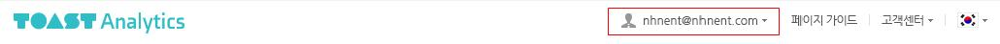

2. 내정보
내 정보 페이지에서는 내 계정, 이름, 소속된 컴퍼니, 현재 설정된 대표앱 등을 확인하실 수 있습니다. 대표앱으로 선택한 앱은 Analytics 분석페이지에서 디폴트로 보여집니다.

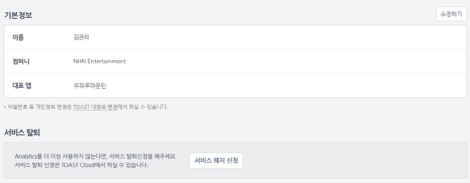

3. 컴퍼니관리
컴퍼니 관리는 컴퍼니 생성자만 사용할 수 있는 메뉴입니다.
계정관리
해당 컴퍼니에 소속된 구성원들을 조회하고, 새로 구성원을 추가하거나 기존 구성원을 삭제할 수 있습니다.
컴퍼니 구성원 추가하기
[신규계정 추가] 버튼을 누르시면 이메일 주소를 입력하여 컴퍼니로 초대하실 수 있습니다. 이 때 초대하려는 계정은 TOAST Cloud에 가입되어 있어야 합니다. 초대를 받은 계정은 초대 메일 내의 인증링크를 클릭하여 Analytics에 들어온 후 로그인을 하면 자신을 초대한 컴퍼니에 소속되게 됩니다.
컴퍼니 구성원 삭제하기
[계정삭제] 버튼을 클릭하면 해당 계정을 컴퍼니에서 삭제하실 수 있습니다. 삭제된 계정은 컴퍼니 초대를 통해 다시 추가가 가능합니다.
구성원의 앱 권한보기
컴퍼니 구성원 각각이 어떤 앱에 소속되어 있는지 확인하실 수 있습니다.
앱 관리
현재 컴퍼니에 소속된 앱 리스트 및 서비스 상태를 확인하실 수 있습니다.

# TOAST Cloud Console에서 시작하기
TOAST Cloud http://console.cloud.toast.com 의 웹 콘솔에서 프로젝트 생성 후, 좌측 Analytics > Game Analytics 메뉴에서 [상품이용] 버튼을 클릭하시면 Analytics 상품 사용이 시작됩니다.

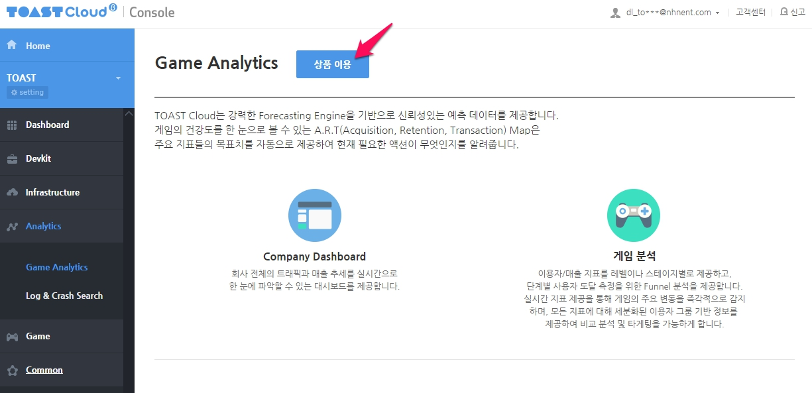

1. 앱 기본정보 등록
[상품이용] 선택하면 앱 등록 페이지로 이동하여, Analytics를 사용하실 수 있습니다. 앱 등록은 앱 등록하기 항목을 참조해주세요. 앱 등록 시 컴퍼니는 새로 생성하거나 속해있던 컴퍼니가 있는 경우 자동으로 선택됩니다.

2. 지표 보기
앱 등록 후 Console 화면에서 기본 모니터링 지표를 확인 할 수 있습니다. 추가 지표는 Console 화면의 상단 [지표분석 더보기] 버튼을 선택하여 Analytics 화면 이동하여 확인할 수 있습니다.
